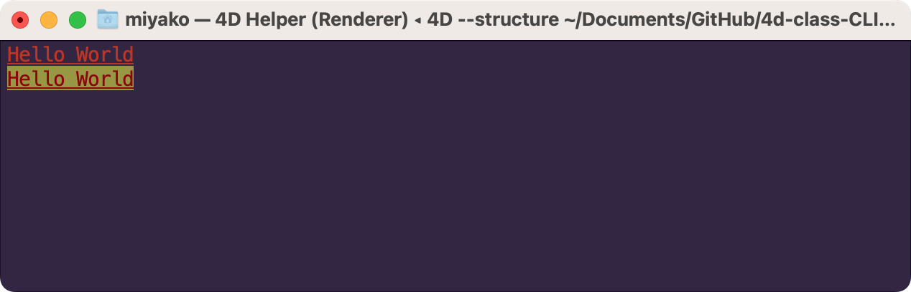

# CLI

`CLI` is a class to print [ASCII escape codes](https://en.wikipedia.org/wiki/ANSI_escape_code). 

## .CR() 

**.CR**() : cs.CLI

Print the carriage-return ASCII code.

## .LF() 

**.LF**() : cs.CLI

Print the line-feed ASCII code.

## .EL() 

**.EL**() : cs.CLI

Erase from cursor to end of line.

## .ES() 

**.ES**() : cs.CLI

Erase entire screen.

## .XY() 

**.XY**($x : Integer; $y : Integer) : cs.CLI

Move cursor to (x,y).

## .hideCursor() 

**.hideCursor**() : cs.CLI

Hide cursor.

## .showCursor() 

**.showCursor**() : cs.CLI

Show cursor.

## .escape() 

**.escape**($message : Text; $style : Text) : Text

Apply ASCII escape codes to `$message`.

## .logo() 

**.logo**() : cs.BuildApp_CLI

Print an ASCII art of the 4D logo.

## .print() 

**.print**($message : Text; $style : Text) : cs.CLI

Print `$message` using ASCII escape codes.

## .version() 

**.version**() : cs.CLI

Print the current 4D version.

```4d
var $CLI : cs.CLI

$CLI:=cs.CLI.new()

//foreground
$CLI.print("Hello World"; "red;bold;underline").LF()
//foreground and background
$CLI.print("Hello World"; "red;yellow;bold;underline").LF()
```



```4d
$CLI.LF()

//16-bit color
For ($i; 0; 255)
	$CLI.print(String($i; "^^0"+"   "); String($i)+";bold")
End for 

$CLI.LF()
```

